# Stable Diffusion (LDM) — JAX/Flax Implementation

A from-scratch implementation of **Latent Diffusion Models** ([Rombach et al., 2022](https://arxiv.org/abs/2112.10752)) in JAX/Flax — the architecture behind Stable Diffusion.

---

## What is LDM?

Latent Diffusion Models run the diffusion process in the latent space of a pretrained autoencoder rather than pixel space, dramatically reducing computational cost while maintaining generation quality. A cross-attention mechanism in the UNet enables text or class conditioning.

---

## Implemented Components

| Component | Description |
|---|---|
| **VAE encoder/decoder** | Compresses images to latent space and reconstructs them |
| **Latent UNet** | Diffusion model operating on VAE latents |
| **Cross-attention conditioning** | Conditioning mechanism in UNet transformer blocks |
| **DDPM/DDIM samplers** | Both training (DDPM) and fast inference (DDIM) |
| **Full two-stage training** | VAE trained first, UNet trained on frozen latents |

---

## Training Details

| Setting | Value |
|---|---|
| Dataset | ImageNet / CelebA |
| Framework | JAX/Flax |
| Accelerator | Google Colab / TPU |

---

## Generated Samples

<!-- Replace this with your actual image grid -->
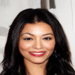
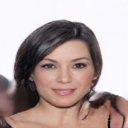
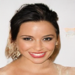
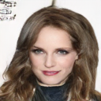
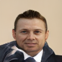
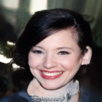
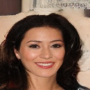
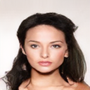
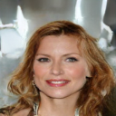
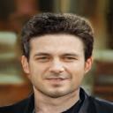
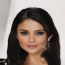
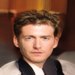

---

## Implementation Notes

Non-trivial details reproduced faithfully from the paper:

- The VAE is trained independently first and frozen before UNet training — the UNet never sees pixel space
- KL regularization weight on the VAE latent space is kept very small (β << 1) to preserve reconstruction quality over disentanglement
- Cross-attention keys and values come from the conditioning signal (class embedding or text), queries from the UNet spatial features
- DDIM sampling at inference requires no retraining — it reuses the same score network with a deterministic update rule

---

## Project Structure
```
Stable-Diffusion-JAX-FLAX/
├── model.py               # VAE / VQ model architecture
├── dit.py                 # DiT (Diffusion Transformer) architecture
├── unet.py                # UNet architecture
├── discriminator.py       # Patch discriminator for perceptual training
├── lpips.py               # Perceptual loss (LPIPS)
├── sampler.py             # DDPM / DDIM samplers
├── dataset.py             # Data loading and preprocessing
├── train_vqmodel.py       # Stage 1: VAE / VQ-VAE training
├── train_diffusion.py     # Stage 2: Diffusion model training
└── inference.py           # Generation script
```

---

## References
```bibtex
@inproceedings{rombach2022ldm,
  title={High-Resolution Image Synthesis with Latent Diffusion Models},
  author={Rombach, Robin and others},
  booktitle={CVPR},
  year={2022}
}
```

**Official Implementations:** [CompVis/latent-diffusion](https://github.com/CompVis/latent-diffusion)

**VQGAN:** [VQGAN](https://github.com/google-research/maskgit)

**SD:** [Stable-Diffusion](https://github.com/explainingai-code/StableDiffusion-PyTorch)

**DiT:** [DiT](https://github.com/facebookresearch/DiT)


