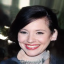
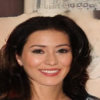

# Stable Diffusion from Scratch in JAX/FLAX

This repository contains a from-scratch implementation of the paper:

> ** High-Resolution Image Synthesis with Latent Diffusion Models **  
> (https://arxiv.org/abs/2112.10752)

# Diffusion Transformer from Scratch in JAX/FLAX

This repository contains a from-scratch implementation of the paper:

> ** Scalable Diffusion Models with Transformers **  
> (https://arxiv.org/abs/2212.09748)


## 🏁 Training VQMODEL

```bash
python train_vqmodel.py configs/celeba_vqmodel.yaml
```

## 🏁 Training Diffusion

```bash
python train_diffusion.py configs/celeba_ddpm_unconditional.yaml
```

## For Text2Image

```bash
python train_vqmodel.py configs/coco_vqmodel.yaml
```

```bash
python train_diffusion.py configs/coco_ddpm_text_conditional.yaml
```


## 🖼 Sample Generated Images From CelebA






## References
VQGAN https://github.com/google-research/maskgit

Stable-Diffusion https://github.com/explainingai-code/StableDiffusion-PyTorch

DiT https://github.com/facebookresearch/DiT
